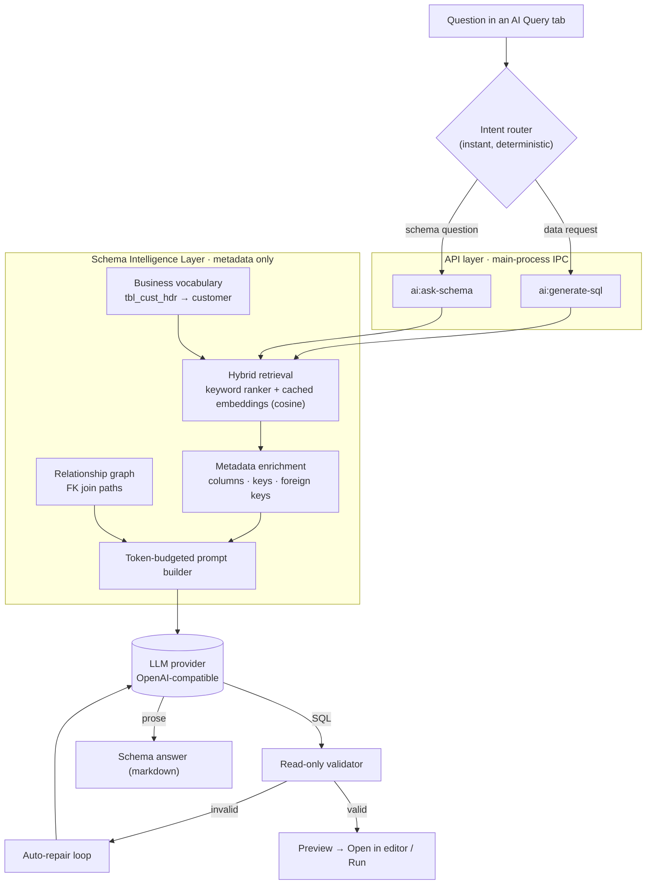

# Tevel IntelliDB

**An AI-first SQL client — a database engineer, not just a chat box.**

Ask a question in plain English; Tevel retrieves the relevant schema, writes the query, validates it for safety, and hands you a preview to review and run.

> 🔒 **Privacy first:** the AI reasons over database **metadata only** — schemas, tables, columns, keys, constraints, indexes, relationships. It **never** receives table rows, query results, or customer data.

## ✨ AI features

- **AI Query tab** — open one from the tab bar's **+** menu (next to *Query Editor*). Ask in plain English; Tevel **auto-detects intent** — write a **SQL query**, or **answer a question about your schema** — and you can force either mode.
- **Hybrid retrieval (RAG)** — a deterministic keyword ranker blended with **semantic embeddings** of your schema, cached locally per connection, so the model only ever sees the handful of tables that matter.
- **Schema Intelligence Layer** — foreign-key relationship graph with join-path finding, and a business vocabulary that understands cryptic names (`tbl_cust_hdr` → *customer header*).
- **Read-only safety gate** — blocks `INSERT/UPDATE/DELETE/DROP/ALTER/TRUNCATE`, injection, and `EXPLAIN ANALYZE` unless you explicitly enable write mode.
- **Auto-repair loop** — invalid SQL is fed back to the model with the error until it validates.
- **Bring your own model** — works with any OpenAI-compatible endpoint: **NVIDIA NIM**, OpenAI, OpenRouter, LM Studio, Ollama. Ships with a fast small default (`meta/llama-3.1-8b-instruct`); pick a larger reasoning model in **AI → Model** anytime.

See [`docs/tevel/`](./docs/tevel/) for the architecture map, roadmap, and implementation notes.

## 🧠 How it works (under the hood)

Every AI request flows API layer → Schema Intelligence Layer → model, and **only schema metadata ever crosses into the prompt** — never row data.



**The retrieval step (RAG):** the first time you use AI on a connection, each table's *doc* (name + humanized name + comment) is embedded via your provider's embeddings endpoint and cached to a small JSON file under the app's user-data dir — no vector-DB process, no native modules. Each question is embedded on the fly; cosine similarity is blended with the keyword ranker so semantically-related tables surface even when the wording doesn't match. If embeddings are disabled or the endpoint is unavailable, retrieval falls back to keyword ranking — the pipeline never breaks. Core pieces live in [`src/main/libs/ai/`](./src/main/libs/ai/).

## 🧩 Supported databases

MySQL / MariaDB · PostgreSQL · SQLite · Firebird SQL

## 🚀 Development

```bash
npm install                 # requires a C toolchain for native modules (better-sqlite3, ssh2)
npm run rebuild:electron
npm run debug               # launch the app

npm run test:ai             # AI-layer unit tests
npm run compile             # production build (main + workers + renderer)
```

## 🙏 Built on Antares

Tevel IntelliDB is a fork of [**Antares SQL**](https://github.com/antares-sql/antares) by [Fabio Di Stasio](https://fabiodistasio.it/) and its community. Antares provides the mature foundation we reuse — connection manager, database drivers, query execution, SSH/SSL tunneling, result grid, tabs, and the database explorer. **Thank you, Antares team.** 💛 Please [star the original repo](https://github.com/antares-sql/antares).

MIT licensed, like Antares.
